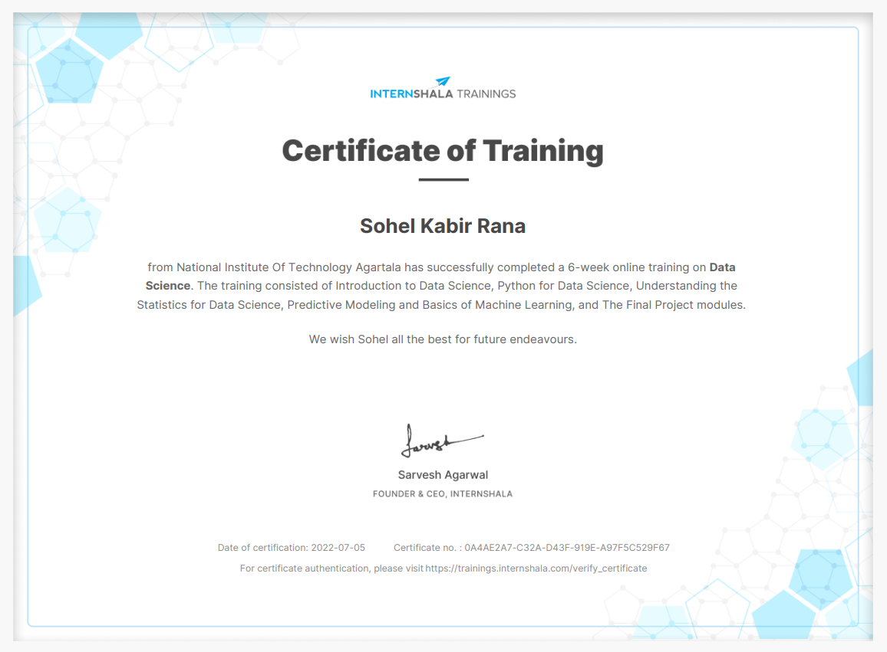

## THE TOPICS THAT WERE COVERED DURING THE SUMMER TRAINING:

 1.INTRODUCTION TO DATA SCIENCE
 2.PYTHON FOR DATA SCIENCE
 3.UNDERSTANDING THE STATISTICS FOR DATA SCIENCE
 4.PREDICTIVE MODELING AND BASICS OF MACHINE LEARNING
 5.FINAL PROJECT
   *final project has been uploaded in this repository, which contains the problem statement along with the solution.*

